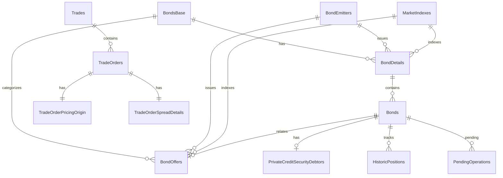

# Schema do Banco de Dados - Sistema Atual (MySQL 8)

## Visão Geral

Este documento mapeia o schema completo do banco de dados atual do **fixed-income-investment-service** que será **MANTIDO** no novo sistema Apex.

**Database:** MySQL 8  
**ORM:** Entity Framework Core  
**Encoding:** UTF-8  

---

## Tabelas Principais - Catálogo de Produtos

### 1. **BondsBase** (Tipos Base de Produtos)

Define os tipos fundamentais de produtos de renda fixa.

| Campo | Tipo | Descrição |
|-------|------|-----------|
| Id | BIGINT (PK, AI) | Chave primária |
| BaseSymbol | VARCHAR(50) NOT NULL | Símbolo do tipo (CDB, LCI, LCA, etc) |
| Description | VARCHAR(255) NOT NULL | Descrição do tipo |
| TypeCore | VARCHAR(50) NOT NULL | Tipo core no sistema |
| HasIncomeTax | BOOLEAN NOT NULL | Se tem incidência de IR |
| GuaranteedByFgc | BOOLEAN NOT NULL | Se é garantido pelo FGC |
| CustodyChamber | CHAR(5) NOT NULL | Câmara de custódia (CETIP/SELIC) |

**Exemplos de Dados:**
```sql
INSERT INTO BondsBase VALUES 
(1, 'CDB', 'Certificado de Depósito Bancário', 'PRIVATE_FIXED_INCOME', TRUE, TRUE, 'CETIP'),
(2, 'LCI', 'Letra de Crédito Imobiliário', 'PRIVATE_FIXED_INCOME', FALSE, TRUE, 'CETIP'),
(3, 'TESOURO', 'Tesouro Direto', 'PUBLIC_BOND', TRUE, FALSE, 'SELIC');
```

**Enum CustodyChamberType:**
- `CETIP`: Títulos privados
- `SELIC`: Títulos públicos

---

### 2. **BondEmitters** (Emissores)

Cadastro de instituições emissoras de títulos.

| Campo | Tipo | Descrição |
|-------|------|-----------|
| Id | BIGINT (PK, AI) | Chave primária |
| ApiId | VARCHAR(36) | ID na API externa |
| Name | VARCHAR(200) NOT NULL | Razão social |
| FantasyName | VARCHAR(200) | Nome fantasia |
| Document | VARCHAR(20) NOT NULL | CNPJ |
| CreatedAt | DATETIME NOT NULL | Data de criação |
| LastUpdatedAt | DATETIME | Última atualização |

---

### 3. **MarketIndexes** (Índices de Mercado)

Índices de referência para rentabilidade.

| Campo | Tipo | Descrição |
|-------|------|-----------|
| Id | BIGINT (PK, AI) | Chave primária |
| Name | VARCHAR(100) NOT NULL | Nome do índice |
| Description | VARCHAR(255) | Descrição |
| CreatedAt | DATETIME NOT NULL | Data de criação |
| LastUpdatedAt | DATETIME | Última atualização |

**Exemplos:**
- CDI (Certificado de Depósito Interbancário)
- IPCA (Índice de Preços ao Consumidor Amplo)
- SELIC (Taxa Básica de Juros)
- PRE (Prefixado - sem índice)

---

### 4. **BondDetails** (Detalhes do Produto)

Contém as características comerciais e financeiras dos produtos.

| Campo | Tipo | Descrição |
|-------|------|-----------|
| Id | BIGINT (PK, AI) | Chave primária |
| BondBaseId | BIGINT NOT NULL (FK) | Tipo do produto |
| BondEmitterId | BIGINT NOT NULL (FK) | Emissor |
| MarketIndexId | BIGINT (FK) | Índice de referência |
| FantasyName | VARCHAR(255) | Nome fantasia do produto |
| IsAvailable | BOOLEAN NOT NULL | Disponível para negociação |
| DeadlineCalendarDays | INT NOT NULL | Prazo total em dias corridos |
| DaysToGracePeriod | INT NOT NULL | Dias de carência |
| BenchmarkPercentualRate | DECIMAL(20,10) NOT NULL | Taxa do índice (ex: 100% CDI) |
| FixedPercentualRate | DECIMAL(20,10) NOT NULL | Taxa fixa (ex: 12% a.a.) |
| InitialUnitValue | DECIMAL(20,10) NOT NULL | Valor inicial unitário |
| IsExemptDebenture | BOOLEAN NOT NULL | Debênture incentivada (isenta IR) |

**Relacionamentos:**
- BondBase (N:1)
- BondEmitter (N:1)
- MarketIndex (N:1)
- Bonds (1:N)

---

### 5. **Bonds** (Títulos Individuais)

Representa os títulos de renda fixa individuais no sistema.

| Campo | Tipo | Descrição |
|-------|------|-----------|
| Id | BIGINT (PK, AI) | Chave primária |
| ApiId | VARCHAR(36) | ID da API externa (Athena) |
| BondDetailId | BIGINT NOT NULL (FK) | Detalhes do produto |
| BondSymbol | VARCHAR(64) NOT NULL | Código único do título |
| Isin | VARCHAR(12) | Código ISIN (padrão internacional) |
| ExpirationAt | DATE NOT NULL | Data de vencimento |
| IssuanceAt | DATE NOT NULL | Data de emissão |
| IsCetipVerified | BOOLEAN NOT NULL DEFAULT FALSE | Verificado na CETIP |

**Índices:**
```sql
CREATE INDEX idx_bondsymbol ON Bonds(BondSymbol);
CREATE INDEX idx_expiration ON Bonds(ExpirationAt);
```

**Relacionamentos:**
- BondDetail (N:1)
- PrivateCreditDebtors (1:1)

---

### 6. **BondOffers** (Ofertas Públicas Iniciais - IPO)

Gerencia ofertas de títulos no mercado primário (integração com Athena).

| Campo | Tipo | Descrição |
|-------|------|-----------|
| Id | BIGINT (PK, AI) | Chave primária |
| ApiId | VARCHAR(36) NOT NULL | ID da oferta no Athena |
| BondId | BIGINT (FK) | Título associado (criado depois) |
| BondBaseId | BIGINT NOT NULL (FK) | Tipo base |
| BondEmitterId | BIGINT NOT NULL (FK) | Emissor |
| BondFeeId | BIGINT (FK) | Taxas |
| MarketIndexId | BIGINT (FK) | Índice |
| Symbol | VARCHAR(50) | Símbolo da oferta |
| ProductName | VARCHAR(100) | Nome do produto |
| **Datas** | | |
| OfferStartDate | DATETIME NOT NULL | Início da oferta |
| OfferExpirationDate | DATETIME NOT NULL | Fim da oferta |
| IssueDate | DATETIME NOT NULL | Data de emissão |
| MaturityDate | DATETIME | Data de vencimento |
| **Prazos** | | |
| TotalDays | INT NOT NULL | Prazo total |
| GracePeriodDays | INT NOT NULL | Carência |
| **Valores e Limites** | | |
| MinimumInvestment | DECIMAL(18,2) NOT NULL | Investimento mínimo |
| InitialInvestmentQuantity | DECIMAL(18,2) | Quantidade inicial |
| MinimumInvestmentQuantity | DECIMAL(18,2) | Quantidade mínima |
| MaximumInvestmentQuantity | DECIMAL(18,2) | Quantidade máxima |
| **Preços** | | |
| UnitPrice | DECIMAL(20,10) NOT NULL | Preço unitário |
| BrokerUnitPrice | DECIMAL(20,10) NOT NULL | Preço para corretora |
| **Taxas de Rentabilidade** | | |
| FixedPercentualRate | DECIMAL(12,6) NOT NULL | Taxa fixa |
| BenchmarkPercentualRate | DECIMAL(12,6) NOT NULL | % do índice |
| Spread | DECIMAL(12,6) NOT NULL | Spread |
| FinancialIncrement | DECIMAL(12,6) | Incremento financeiro |
| **Amortização e Juros** | | |
| AmortizationStartDate | DATETIME | Início amortização |
| AmortizationFrequency | INT NOT NULL | Frequência amortização (dias) |
| AmortizationGracePeriodDays | INT | Carência amortização |
| InterestFrequency | INT NOT NULL | Frequência juros |
| InterestGracePeriodDays | INT | Carência juros |
| **Classificações** | | |
| CreditRate | VARCHAR(50) NOT NULL | Rating (AAA, AA, A, etc) |
| RiskRate | INT NOT NULL | Nível de risco (1-5) |
| **Características** | | |
| IsPutable | BOOLEAN NOT NULL | Permite resgate antecipado |
| OfferType | INT NOT NULL | Tipo de oferta (PRIMARY/SECONDARY) |
| IsActive | BOOLEAN NOT NULL | Está ativa |
| CreatedAt | DATETIME NOT NULL | Data de criação |
| LastUpdatedAt | DATETIME | Última atualização |

---

## Tabelas de Negociação

### 7. **Trades** (Negociações)

Representa as negociações realizadas (primário ou secundário).

| Campo | Tipo | Descrição |
|-------|------|-----------|
| Id | BIGINT (PK, AI) | Chave primária |
| BasePrice | DECIMAL(20,10) | Preço base |
| BaseRate | DECIMAL(20,10) | Taxa base |
| Rate | DECIMAL(20,10) | Taxa negociada |
| Price | DECIMAL(20,10) | Preço negociado |
| OperatedAt | DATE | Data da operação |
| LiquidatedAt | DATE | Data de liquidação |
| Company | INT | Código da empresa (enum) |
| CreatedAt | DATETIME NOT NULL | Data de criação |
| UpdatedAt | DATETIME | Última atualização |

**Relacionamentos:**
- TradeOrders (1:N)

---

### 8. **TradeOrders** (Ordens de Trade)

Liga as ordens aos trades e aos clientes.

| Campo | Tipo | Descrição |
|-------|------|-----------|
| Id | BIGINT (PK, AI) | Chave primária |
| TradeId | BIGINT (FK) | Trade associado |
| **Identificação** | | |
| CustomerApiId | VARCHAR(36) | ID do cliente na API |
| OrderRequestId | VARCHAR(36) | ID da requisição (idempotência) |
| TransactionApiId | VARCHAR(36) | ID da transação |
| PortfolioApiId | VARCHAR(36) | ID do portfólio |
| **Valores** | | |
| Rate | DECIMAL(20,10) | Taxa |
| PurchaseUnitPrice | DECIMAL(20,10) | Preço unitário na compra |
| PurchaseGrossValue | DECIMAL(20,10) | Valor bruto da compra |
| **Flags** | | |
| IsRebalance | BOOLEAN NOT NULL DEFAULT FALSE | É rebalanceamento |
| CreatedAt | DATETIME NOT NULL | Data de criação |
| UpdatedAt | DATETIME | Última atualização |

**Índices:**
```sql
CREATE INDEX idx_customer ON TradeOrders(CustomerApiId);
CREATE INDEX idx_order_request ON TradeOrders(OrderRequestId);
```

---

### 9. **TradeOrderPricingOrigin** ⭐ (NOVA FEATURE)

Rastreia a origem da precificação para cada ordem de trade.

| Campo | Tipo | Descrição |
|-------|------|-----------|
| Id | BIGINT (PK, AI) | Chave primária |
| TradeOrderId | BIGINT NOT NULL (FK) | Ordem de trade |
| **Origem** | | |
| PricingOriginType | VARCHAR(50) NOT NULL | VENDOR, MANUAL, ANBIMA, etc |
| SourceSystem | VARCHAR(100) | Sistema de origem |
| SourceTimestamp | DATETIME | Quando foi precificado |
| **Validação Temporal** | | |
| ValidFrom | DATETIME NOT NULL | Válido a partir de |
| ValidUntil | DATETIME | Válido até |
| **Dados** | | |
| PricingData | JSON | Dados completos em JSON |
| CreatedAt | DATETIME NOT NULL | Data de criação |
| UpdatedAt | DATETIME | Última atualização |

**Índices:**
```sql
CREATE INDEX idx_valid_period ON TradeOrderPricingOrigin(ValidFrom, ValidUntil);
```

**Casos de Uso:**
- Rastrear de onde veio o preço usado na ordem
- Validar se o preço ainda está válido temporalmente
- Auditoria de precificação

---

### 10. **TradeOrderSpreadDetails** (Detalhes de Spread)

Armazena informações detalhadas sobre spreads aplicados.

| Campo | Tipo | Descrição |
|-------|------|-----------|
| Id | BIGINT (PK, AI) | Chave primária |
| TradeOrderId | BIGINT NOT NULL (FK) | Ordem de trade |
| SpreadPercentage | DECIMAL(12,6) | % de spread |
| SpreadBasisPoints | INT | Spread em bps |
| SpreadAmount | DECIMAL(20,10) | Valor do spread |
| SpreadSource | VARCHAR(100) | De onde veio o spread |
| AppliedAt | DATETIME | Quando foi aplicado |
| CreatedAt | DATETIME NOT NULL | Data de criação |

---

### 11. **Orders** (Ordens de Operação)

Representa ordens de compra/venda processadas.

| Campo | Tipo | Descrição |
|-------|------|-----------|
| Id | BIGINT (PK, AI) | Chave primária |
| Direction | VARCHAR(10) NOT NULL | BUY, SELL (enum) |
| Status | VARCHAR(20) NOT NULL | PENDING, EXECUTED, CANCELLED |
| GrossValue | DECIMAL(20,10) | Valor bruto |
| NetValue | DECIMAL(20,10) | Valor líquido |
| IncomeTax | DECIMAL(20,10) | IR |
| OperationTax | DECIMAL(20,10) | IOF |
| IncomeOnWithdraw | DECIMAL(20,10) | Rendimento no resgate |
| Quotes | DECIMAL(20,10) | Quantidade de cotas |
| ConvertedAt | DATE | Data de conversão |
| LiquidatedAt | DATE | Data de liquidação |

**Enum OrderDirection:**
- `BUY`: Compra
- `SELL`: Venda/Resgate

**Enum OrderStatus:**
- `PENDING`: Aguardando processamento
- `EXECUTED`: Executada
- `CANCELLED`: Cancelada
- `FAILED`: Falhou

---

## Tabelas de Posição e Histórico

### 12. **HistoricPositions** (Posições Históricas)

Snapshot diário das posições dos clientes.

| Campo | Tipo | Descrição |
|-------|------|-----------|
| Id | BIGINT (PK, AI) | Chave primária |
| CustomerApiId | VARCHAR(36) NOT NULL | ID do cliente |
| BondId | BIGINT NOT NULL (FK) | Título |
| SnapshotDate | DATE NOT NULL | Data do snapshot |
| **Quantidades** | | |
| TotalQuantity | DECIMAL(20,10) | Quantidade total |
| AvailableQuantity | DECIMAL(20,10) | Quantidade disponível |
| BlockedQuantity | DECIMAL(20,10) | Quantidade bloqueada |
| **Valores** | | |
| InvestedAmount | DECIMAL(20,10) | Valor investido |
| CurrentValue | DECIMAL(20,10) | Valor atual |
| UnrealizedGainLoss | DECIMAL(20,10) | Ganho/perda não realizado |
| **Rentabilidade** | | |
| YieldRate | DECIMAL(12,6) | Taxa de rendimento |
| YieldAmount | DECIMAL(20,10) | Valor do rendimento |
| CreatedAt | DATETIME NOT NULL | Data de criação |

**Índices:**
```sql
CREATE UNIQUE INDEX idx_position_snapshot ON HistoricPositions(CustomerApiId, BondId, SnapshotDate);
CREATE INDEX idx_customer_date ON HistoricPositions(CustomerApiId, SnapshotDate);
```

---

### 13. **PendingOperations** (Operações Pendentes)

Controla operações que aguardam processamento ou confirmação.

| Campo | Tipo | Descrição |
|-------|------|-----------|
| Id | BIGINT (PK, AI) | Chave primária |
| OperationType | VARCHAR(50) NOT NULL | PURCHASE, REDEMPTION, TRANSFER |
| ReferenceId | VARCHAR(100) | ID de referência externa |
| CustomerApiId | VARCHAR(36) NOT NULL | ID do cliente |
| BondId | BIGINT (FK) | Título |
| Amount | DECIMAL(20,10) | Valor |
| Quantity | DECIMAL(20,10) | Quantidade |
| Status | VARCHAR(20) NOT NULL | PENDING, PROCESSING, COMPLETED, FAILED |
| RetryCount | INT NOT NULL DEFAULT 0 | Contador de tentativas |
| LastRetryAt | DATETIME | Última tentativa |
| ErrorMessage | TEXT | Mensagem de erro |
| CreatedAt | DATETIME NOT NULL | Data de criação |
| UpdatedAt | DATETIME | Última atualização |
| ProcessedAt | DATETIME | Data de processamento |

**Índices:**
```sql
CREATE INDEX idx_status ON PendingOperations(Status, CreatedAt);
CREATE INDEX idx_reference ON PendingOperations(ReferenceId);
```

---

## Tabelas de Integração e Mensageria

### 14. **OrdersOutbox** (Outbox Pattern para Kafka)

Implementação do Outbox Pattern para garantir entrega de mensagens ao Kafka.

| Campo | Tipo | Descrição |
|-------|------|-----------|
| Id | BIGINT (PK, AI) | Chave primária |
| OrderMessageType | VARCHAR(50) | Tipo da mensagem |
| OrderMessageKey | VARCHAR(100) | Chave da mensagem (partition key) |
| OrderMessage | JSON NOT NULL | Payload completo em JSON |
| IsMessageProduced | BOOLEAN NOT NULL DEFAULT FALSE | Já foi publicada? |
| CreatedAt | DATE | Data de criação |
| LastUpdatedAt | DATE | Última atualização |

**Índices:**
```sql
CREATE INDEX idx_pending_messages ON OrdersOutbox(IsMessageProduced, CreatedAt);
```

**Fluxo:**
1. Transação salva dados + insere na Outbox
2. Worker separado lê Outbox e publica no Kafka
3. Marca como `IsMessageProduced = TRUE`
4. Garante que nenhuma mensagem é perdida (atomicidade)

---

### 15. **TransactionIntegrations** (Integrações de Transação)

Rastreia integrações com sistemas externos.

| Campo | Tipo | Descrição |
|-------|------|-----------|
| Id | BIGINT (PK, AI) | Chave primária |
| ExternalSystemName | VARCHAR(100) NOT NULL | Nome do sistema externo |
| ExternalTransactionId | VARCHAR(100) NOT NULL | ID na transação externa |
| InternalReferenceId | VARCHAR(100) | ID interno |
| IntegrationType | VARCHAR(50) NOT NULL | VENDOR, CUSTODY, SETTLEMENT |
| Status | VARCHAR(20) NOT NULL | PENDING, SUCCESS, FAILED |
| RequestPayload | JSON | Payload da requisição |
| ResponsePayload | JSON | Payload da resposta |
| ErrorMessage | TEXT | Mensagem de erro |
| CreatedAt | DATETIME NOT NULL | Data de criação |
| LastUpdatedAt | DATETIME | Última atualização |

**Índices:**
```sql
CREATE INDEX idx_external_ref ON TransactionIntegrations(ExternalSystemName, ExternalTransactionId);
CREATE INDEX idx_status ON TransactionIntegrations(Status, CreatedAt);
```

---

## Tabelas Auxiliares

### 16. **Customers** (Cache de Clientes)

Cache local de informações de clientes (vindas do sistema IAM).

| Campo | Tipo | Descrição |
|-------|------|-----------|
| Id | BIGINT (PK, AI) | Chave primária |
| ApiId | VARCHAR(36) NOT NULL UNIQUE | ID do cliente no IAM |
| Name | VARCHAR(200) | Nome |
| Document | VARCHAR(20) | CPF/CNPJ |
| Email | VARCHAR(200) | E-mail |
| IsActive | BOOLEAN NOT NULL DEFAULT TRUE | Ativo? |
| CreatedAt | DATETIME NOT NULL | Data de criação |
| LastUpdatedAt | DATETIME | Última atualização |

**Índices:**
```sql
CREATE UNIQUE INDEX idx_api_id ON Customers(ApiId);
CREATE INDEX idx_document ON Customers(Document);
```

---

### 17. **CalendarDays** (Calendário)

Calendário com dias úteis e feriados.

| Campo | Tipo | Descrição |
|-------|------|-----------|
| Id | BIGINT (PK, AI) | Chave primária |
| Date | DATE NOT NULL UNIQUE | Data |
| IsBusinessDay | BOOLEAN NOT NULL | É dia útil? |
| IsHoliday | BOOLEAN NOT NULL | É feriado? |
| Description | VARCHAR(200) | Descrição do feriado |

---

### 18. **BypassBalanceValidation** (Bypass de Validação de Saldo)

Permite bypass temporário de validação de saldo para clientes específicos.

| Campo | Tipo | Descrição |
|-------|------|-----------|
| Id | BIGINT (PK, AI) | Chave primária |
| CustomerApiId | VARCHAR(36) NOT NULL | ID do cliente |
| Reason | VARCHAR(500) | Justificativa |
| IsActive | BOOLEAN NOT NULL DEFAULT TRUE | Ativo? |
| CreatedAt | DATETIME NOT NULL | Data de criação |
| ExpiresAt | DATETIME | Data de expiração |

---

### 19. **NotMatchedOrders** (Ordens Não Conciliadas)

Registra ordens que falharam na conciliação com sistemas externos.

| Campo | Tipo | Descrição |
|-------|------|-----------|
| Id | BIGINT (PK, AI) | Chave primária |
| OrderId | BIGINT | ID da ordem interna |
| ExternalOrderId | VARCHAR(100) | ID da ordem externa |
| Reason | TEXT | Motivo da não conciliação |
| CreatedAt | DATETIME NOT NULL | Data de criação |
| ResolvedAt | DATETIME | Data de resolução |

---

### 20. **PrivateCreditSecurityDebtors** (Devedores de Crédito Privado)

Informações sobre devedores em operações de crédito privado.

| Campo | Tipo | Descrição |
|-------|------|-----------|
| Id | BIGINT (PK, AI) | Chave primária |
| BondId | BIGINT NOT NULL (FK) | Título associado |
| DebtorName | VARCHAR(200) | Nome do devedor |
| DebtorDocument | VARCHAR(20) | CNPJ do devedor |
| CreatedAt | DATETIME NOT NULL | Data de criação |

---

## Diagrama de Relacionamentos



---

## Índices de Performance

### Índices Críticos para Performance

```sql
-- Bonds
CREATE INDEX idx_bonds_symbol ON Bonds(BondSymbol);
CREATE INDEX idx_bonds_expiration ON Bonds(ExpirationAt);
CREATE INDEX idx_bonds_api_id ON Bonds(ApiId);

-- BondOffers
CREATE INDEX idx_bondoffers_active ON BondOffers(IsActive, OfferExpirationDate);
CREATE INDEX idx_bondoffers_api ON BondOffers(ApiId);

-- TradeOrders
CREATE INDEX idx_tradeorders_customer ON TradeOrders(CustomerApiId);
CREATE INDEX idx_tradeorders_request ON TradeOrders(OrderRequestId);

-- HistoricPositions
CREATE UNIQUE INDEX idx_position_snapshot ON HistoricPositions(CustomerApiId, BondId, SnapshotDate);

-- PendingOperations
CREATE INDEX idx_pending_ops_status ON PendingOperations(Status, CreatedAt);

-- OrdersOutbox
CREATE INDEX idx_outbox_pending ON OrdersOutbox(IsMessageProduced, CreatedAt);

-- TransactionIntegrations
CREATE INDEX idx_txn_external ON TransactionIntegrations(ExternalSystemName, ExternalTransactionId);
```

---

## Considerações Técnicas

### 1. **Precision em Campos Decimais**

- `DECIMAL(20,10)`: Preços, taxas, PUs - máxima precisão
- `DECIMAL(18,2)`: Valores monetários padrão
- `DECIMAL(12,6)`: Percentuais, spreads, taxas

### 2. **Campos JSON**

- `OrdersOutbox.OrderMessage`: Mensagens Kafka
- `TradeOrderPricingOrigin.PricingData`: Dados de precificação
- `TransactionIntegrations.RequestPayload/ResponsePayload`: Payloads

### 3. **Isolation Levels Recomendados**

- **READ COMMITTED** (padrão): Maioria das operações
- **SERIALIZABLE**: Operações críticas de concorrência (ex: decrementar quantidade disponível)
- **SELECT FOR UPDATE**: Quando precisa travar registros

### 4. **Particionamento (Futuro)**

Considerar para:
- `HistoricPositions` por `SnapshotDate` (mensal/anual)
- `OrdersOutbox` por `CreatedAt` (mensal)
- `TransactionIntegrations` por `CreatedAt` (mensal)

---

## Queries Críticas Identificadas

### 1. Buscar produtos ativos disponíveis
```sql
SELECT b.*, bd.*, bb.*, be.*
FROM Bonds b
JOIN BondDetails bd ON b.BondDetailId = bd.Id
JOIN BondsBase bb ON bd.BondBaseId = bb.Id
JOIN BondEmitters be ON bd.BondEmitterId = be.Id
WHERE bd.IsAvailable = TRUE 
  AND b.ExpirationAt > CURDATE()
  AND b.IsCetipVerified = TRUE;
```

### 2. Buscar posição do cliente
```sql
SELECT hp.*
FROM HistoricPositions hp
WHERE hp.CustomerApiId = ?
  AND hp.SnapshotDate = CURDATE();
```

### 3. Buscar ordens pendentes para processar
```sql
SELECT po.*
FROM PendingOperations po
WHERE po.Status = 'PENDING'
  AND po.RetryCount < 3
ORDER BY po.CreatedAt ASC
LIMIT 100;
```

### 4. Buscar mensagens não publicadas (Outbox)
```sql
SELECT oo.*
FROM OrdersOutbox oo
WHERE oo.IsMessageProduced = FALSE
ORDER BY oo.CreatedAt ASC
LIMIT 100;
```

---

## Estratégia de Migração para o Apex

### O que MANTER:
✅ Todas as tabelas existentes  
✅ Todos os campos e tipos de dados  
✅ Todos os relacionamentos (FKs)  
✅ Schema do MySQL 8  

### O que ADICIONAR:
➕ Novas tabelas via migrations do EF Core  
➕ Novos índices para otimização  
➕ Novas colunas em tabelas existentes (com cuidado)  

### O que REFATORAR:
🔄 Queries N+1 → Bulk operations  
🔄 Lógica espalhada → Consolidar em Domain Services  
🔄 Falta de transactions → Adicionar UnitOfWork  
🔄 Sem retry/circuit breaker → Adicionar Polly  

---

## Próximos Passos

1. ✅ Schema mapeado completamente
2. ⏭️ Mapear **Data Models** (entidades C#)
3. ⏭️ Identificar **principais queries** e otimizações
4. ⏭️ Definir **agregados** e **bounded contexts** para o Apex
5. ⏭️ Criar **migrations iniciais** do projeto Apex

---

**Última Atualização:** 2025-01-19  
**Versão do Schema:** MySQL 8.0  
**ORM:** Entity Framework Core 8.0
